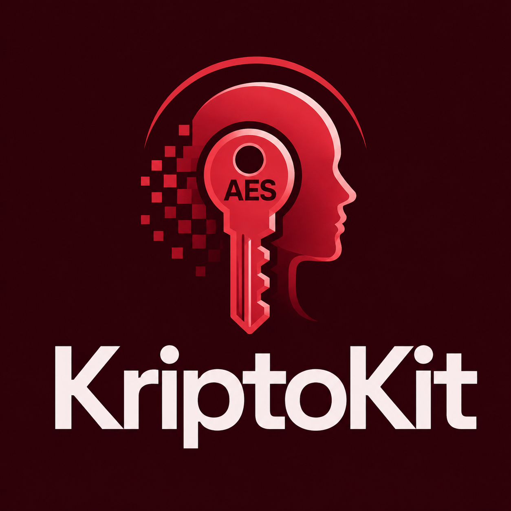

<p align="center">
  
</p>

<p align="center">
  
  
  
  
</p>

<p align="center">
  KriptoKit adalah toolkit kriptografi browser-side untuk demo UAS Kriptografi yang fokus pada tampilan editorial, workflow drag-and-drop, dan pemrosesan data yang tetap lokal di browser.
</p>

## 🔎 Project overview

KriptoKit adalah aplikasi web kriptografi ringan yang berjalan sepenuhnya di sisi browser. Aplikasi ini dibuat untuk menampilkan beberapa operasi kriptografi dasar dalam satu antarmuka yang rapi, compact, dan cocok untuk presentasi.

Fokus utama proyek ini:

- semua proses berjalan lokal di browser
- tidak ada login, database, atau backend API
- cocok untuk demonstrasi tugas akhir / UAS
- UI dibuat dark, editorial, dan modern

## ✨ Main features

- AES-GCM encrypt / decrypt berbasis password
- Base64 encode / decode
- SHA-256 text hashing
- ROT13 transform
- Hex encode / decode
- verifikasi integritas file dengan SHA-256
- drag-and-drop untuk mengaktifkan operasi
- pencarian operasi dari sidebar
- tampilan browser-side only, tanpa upload ke server

## 🧱 Tech stack

- Next.js 14.2.33
- React 18.3.1
- TypeScript
- Browser Web Crypto API

## 📁 Repository structure

```txt
KriptoKit/
├── app/
│   ├── client-shell.tsx   # UI utama dan logic interaksi
│   ├── globals.css        # styling global dan visual system
│   ├── layout.tsx         # metadata aplikasi
│   └── page.tsx           # entry page
├── assets/
│   └── Logo.png           # logo utama untuk README dan branding
├── lib/
│   └── crypto.ts          # helper crypto browser-side
├── wireframe.html         # referensi visual / wireframe
├── index.html             # artefak halaman statis
├── CONTEXT.md             # konteks proyek
├── package.json           # scripts dan dependencies
├── package-lock.json      # locked dependencies
├── next-env.d.ts          # typing Next.js
├── tsconfig.json          # konfigurasi TypeScript
└── README.md              # dokumentasi proyek
```

## ✅ Requirements

- Node.js `>=20 <23`
- npm
- Browser modern yang mendukung Web Crypto API

Rekomendasi runtime:

- Node.js 22
- Ubuntu / Debian / distro Linux modern lainnya

## ⚙️ Local setup

### 1. Clone repository

```bash
git clone <repo-url>
cd KriptoKit
```

### 2. Install dependencies

```bash
npm ci
```

### 3. Jalankan development server

```bash
npm run dev
```

Lalu buka:

```bash
http://localhost:3000
```

### 4. Verifikasi build

```bash
npm run typecheck
npm run build
npm run start
```

## 🐧 Ubuntu / Debian deployment

Langkah aman untuk testing di Ubuntu/Debian:

### 1. Install Node.js 22

Jika memakai `nvm`:

```bash
nvm install 22
nvm use 22
```

### 2. Clone repository

```bash
git clone <repo-url>
cd KriptoKit
```

### 3. Install dependencies

```bash
npm ci
```

### 4. Build untuk production

```bash
npm run typecheck
npm run build
```

### 5. Jalankan production app

```bash
npm run start
```

Aplikasi akan berjalan di:

```bash
http://localhost:3000
```

### 6. Akses dari device lain di jaringan lokal

Jika ingin dibuka dari perangkat lain di LAN, jalankan dev mode dengan hostname publik:

```bash
npm run dev -- --hostname 0.0.0.0
```

## 🔐 Cara kerja fitur cryptography

### AES-GCM

- input plaintext dan password
- hasil enkripsi disimpan sebagai JSON bundle
- bundle berisi `salt`, `iv`, dan `ciphertext`
- decrypt memakai payload yang sama dan password yang sesuai

### SHA-256 verification

- user memilih file target
- user memilih file TXT referensi yang berisi hash SHA-256 hex
- aplikasi menghitung hash file target secara lokal
- hasil dibandingkan dengan hash referensi

### Base64 / ROT13 / Hex

- semua transformasi dilakukan langsung di browser
- tidak ada request ke server
- output bisa dipakai ulang untuk demo atau presentasi

## 🎨 Visual reference

- `wireframe.html` berisi referensi visual terbaru untuk layout KriptoKit.
- Header wireframe sekarang mengikuti branding logo yang dipakai di README.

## 📝 Notes

- Aplikasi ini memang sengaja dibuat client-side only.
- Tidak ada database.
- Tidak ada file upload ke server.
- Tidak ada backend API.
- Clipboard API dipakai untuk menyalin hasil output.
- Drag-and-drop adalah cara utama untuk mengaktifkan operation workspace.

## 📌 Untuk presentasi

Kalau ingin menjelaskan proyek ini ke dosen atau penguji, ringkasannya begini:

> KriptoKit adalah web app kriptografi ringan yang berjalan sepenuhnya di browser untuk demonstrasi AES-GCM, Base64, SHA-256, ROT13, Hex conversion, dan file integrity verification tanpa backend.

## 📄 License

Belum ditentukan. Jika dibutuhkan, tambahkan lisensi sesuai kebutuhan proyek.
