<p align="center">
  
</p>

<p align="center">
  
  
  
  
</p>

<p align="center">
  KriptoKit adalah toolkit kriptografi browser-side untuk proyek final Kriptografi. Aplikasi ini dibuat compact, editorial, dan sepenuhnya berjalan di browser tanpa backend.
</p>

## Overview

KriptoKit adalah aplikasi web kriptografi ringan yang berjalan sepenuhnya di sisi browser. Proyek ini dirancang untuk presentasi tugas akhir/UAS dengan tampilan yang kuat secara visual, alur interaksi yang sederhana, dan fokus pada demo fitur kriptografi dasar.

Ciri utama proyek ini:
- tampilan dark maroon dengan nuansa editorial
- header ticker yang berjalan di area hero
- background grid sebagai elemen visual
- alur drag-and-drop untuk aktivasi operasi
- semua pemrosesan tetap lokal di browser

## Goals

- Menampilkan AES multi-mode untuk enkripsi dan dekripsi teks.
- Menyediakan Base64 encode/decode.
- Menyediakan hashing SHA-256 untuk teks.
- Menyediakan ROT13 dan konversi Hex.
- Menyediakan verifikasi integritas file lewat SHA-256.
- Menjaga semuanya client-side.
- Menjaga UI tetap compact dan rapi untuk presentasi.

## Non-Goals

- Tidak ada login.
- Tidak ada database.
- Tidak ada backend API.
- Tidak ada upload file ke server.
- Tidak ada kolaborasi multi-user.
- Tidak ada chaining kompleks seperti CyberChef.

## Main features

- AES encrypt / decrypt berbasis password dengan mode GCM, CBC, dan CFB
- Base64 encode / decode
- SHA-256 text hashing
- ROT13 transform
- Hex encode / decode
- verifikasi integritas file dengan SHA-256
- drag-and-drop untuk mengaktifkan operasi
- pencarian operasi dari sidebar
- tampilan browser-side only, tanpa upload ke server

## Tech stack

- Next.js 14.2.33
- React 18.3.1
- TypeScript
- Browser Web Crypto API

## Current UI direction

- Dark background dengan aksen maroon
- White grid / grid overlay
- Ambient glow merah-maroon
- Judul editorial yang besar
- Running ticker di atas area hero
- Layout 3 kolom yang compact
  - kiri: daftar operasi
  - tengah: SHA-256 verification tool
  - kanan: workspace operasi aktif
- Aktivasi utama lewat drag-and-drop

## Repository structure

```txt
KriptoKit/
├── app/
│   ├── client-shell.tsx   # UI utama dan logic interaksi
│   ├── globals.css        # styling global dan visual system
│   ├── layout.tsx         # metadata aplikasi
│   └── page.tsx           # entry page
├── assets/
│   └── Logo.png           # logo utama KriptoKit
├── lib/
│   └── crypto.ts          # helper crypto browser-side
├── wireframe.html         # referensi visual / wireframe
├── index.html             # artefak halaman statis
├── CONTEXT.md             # konteks proyek dan arah UI
├── package.json           # scripts dan dependencies
├── package-lock.json      # locked dependencies
├── next-env.d.ts          # typing Next.js
├── tsconfig.json          # konfigurasi TypeScript
└── README.md              # dokumentasi proyek
```

## Requirements

- Node.js `>=20 <26`
- npm
- Browser modern yang mendukung Web Crypto API

Rekomendasi runtime:
- Node.js 22
- Ubuntu / Debian / distro Linux modern lainnya

## Important scripts

- `npm run dev` - local development
- `npm run build` - production build
- `npm run start` - run production build
- `npm run typecheck` - TypeScript check

## Local setup

### 1. Clone repository

```bash
git clone <repo-url>
cd KriptoKit
```

### 2. Install dependencies

```bash
npm ci
```

### 3. Jalankan development server

```bash
npm run dev
```

Lalu buka:

```bash
http://localhost:3000
```

### 4. Verifikasi build

```bash
npm run typecheck
npm run build
npm run start
```

## Ubuntu / Debian deployment

Langkah aman untuk testing di Ubuntu/Debian:

### 1. Install Node.js 22

Jika memakai `nvm`:

```bash
nvm install 22
nvm use 22
```

### 2. Clone repository

```bash
git clone <repo-url>
cd KriptoKit
```

### 3. Install dependencies

```bash
npm ci
```

### 4. Build untuk production

```bash
npm run typecheck
npm run build
```

### 5. Jalankan production app

```bash
npm run start
```

Aplikasi akan berjalan di:

```bash
http://localhost:3000
```

### 6. Akses dari device lain di jaringan lokal

Jika ingin dibuka dari perangkat lain di LAN, jalankan dev mode dengan hostname publik:

```bash
npm run dev -- --hostname 0.0.0.0
```


---

# Cara Menggunakan KriptoKit

KriptoKit memakai konsep **operation workspace**. User memilih operasi dari panel kiri, lalu mengaktifkannya dengan cara **drag-and-drop** ke area workspace kanan.

## Alur Umum Penggunaan

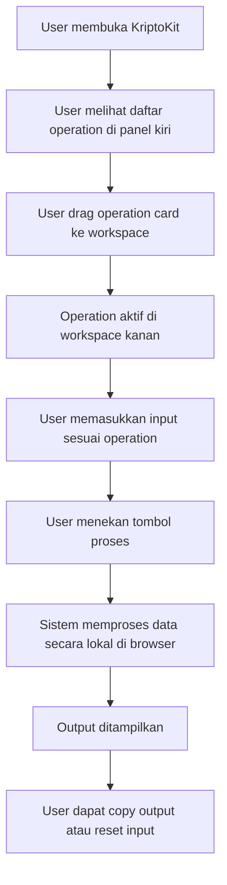

## Catatan Browser-Side

Seluruh proses dilakukan di browser.

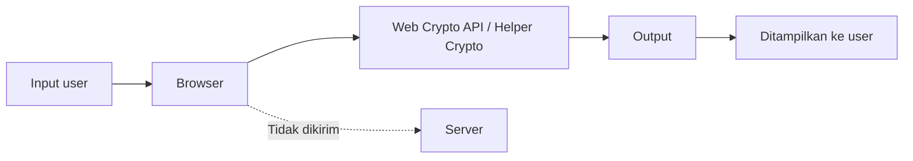

Artinya:

- File tidak dikirim ke server.
- Key/password tidak dikirim ke server.
- Plaintext dan ciphertext diproses lokal.
- Aplikasi tidak membutuhkan backend atau database.

---

# Operation Guide

Bagian ini menjelaskan cara memakai setiap operation di KriptoKit.

---

## 1. AES Encrypt / Decrypt

AES digunakan untuk melakukan **enkripsi** dan **dekripsi** teks menggunakan password/key. KriptoKit mendukung mode AES seperti **GCM**, **CBC**, dan **CFB**.

### Fungsi

- Mengubah plaintext menjadi ciphertext.
- Mengembalikan ciphertext menjadi plaintext menggunakan key yang sama.
- Mendemonstrasikan konsep enkripsi simetris.

### Istilah Penting

| Istilah | Penjelasan |
|---|---|
| Plaintext | Teks asli sebelum dienkripsi |
| Ciphertext | Teks hasil enkripsi |
| Key / Password | Kunci rahasia untuk encrypt dan decrypt |
| IV | Initialization Vector, metadata yang diperlukan untuk proses AES |
| Bundle | Paket output berisi ciphertext dan metadata seperti IV, mode, dan encoding |

### Kenapa AES Memakai Bundle?

Pada AES, proses dekripsi tidak cukup hanya membutuhkan ciphertext dan key. Beberapa mode AES juga membutuhkan metadata seperti `iv`, `mode`, dan `encoding`.

Karena itu, output enkripsi KriptoKit sebaiknya berbentuk JSON bundle, misalnya:

```json
{
  "app": "KriptoKit",
  "algorithm": "AES",
  "mode": "AES-GCM",
  "iv": "00112233445566778899aabb",
  "ciphertext": "BASE64_CIPHERTEXT_HERE",
  "encoding": "base64"
}
```

Saat decrypt, user cukup paste bundle tersebut dan memasukkan key yang sama.

### Cara Encrypt

1. Drag operation **AES Encrypt / Decrypt** ke workspace.
2. Pilih mode AES, misalnya `AES-GCM`.
3. Masukkan plaintext.
4. Masukkan key/password.
5. Pilih IV:
   - `Random IV` untuk penggunaan normal.
   - `Manual IV` untuk testing/demo.
6. Klik tombol **Encrypt**.
7. Salin output JSON bundle.

### Cara Decrypt

1. Masih di operation AES.
2. Ubah mode ke **Decrypt** jika tersedia.
3. Paste output JSON bundle dari proses encrypt.
4. Masukkan key/password yang sama.
5. Klik tombol **Decrypt**.
6. Plaintext asli akan muncul jika key dan bundle benar.

### IV Manual untuk Testing

Gunakan nilai berikut saat demo atau pengujian manual:

| Mode | Panjang IV | Contoh IV Manual |
|---|---:|---|
| AES-GCM | 12 bytes / 24 hex | `00112233445566778899aabb` |
| AES-CBC | 16 bytes / 32 hex | `00112233445566778899aabbccddeeff` |
| AES-CFB | 16 bytes / 32 hex | `00112233445566778899aabbccddeeff` |

> Catatan: IV tidak bersifat rahasia, tetapi harus tersedia kembali saat proses decrypt.

### Flowchart AES Encrypt

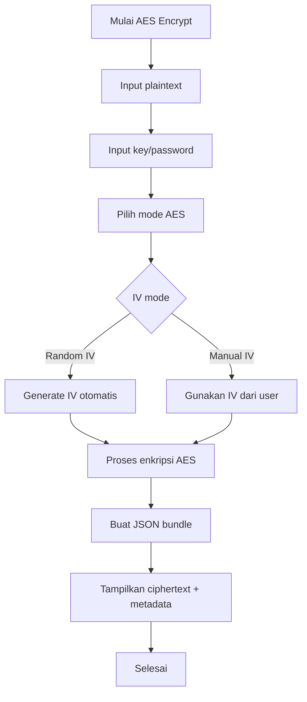

### Flowchart AES Decrypt

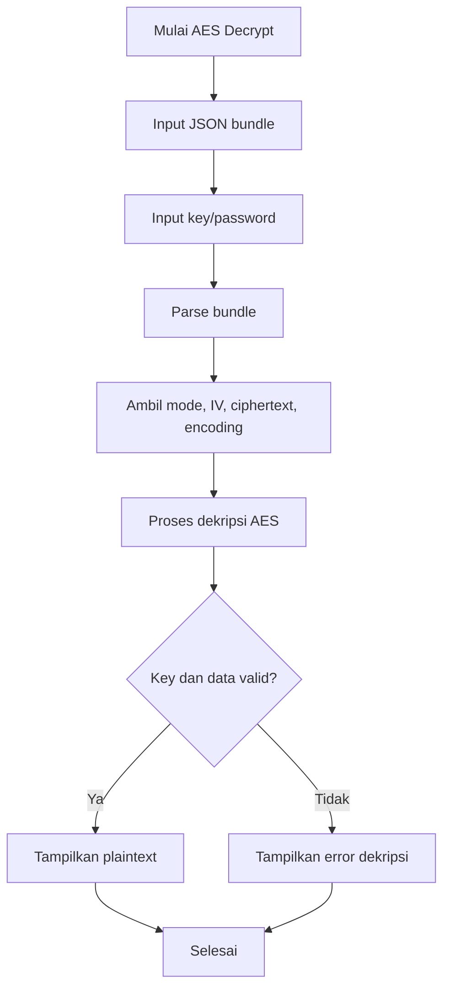

### Contoh Pengujian AES

| Skenario | Input | Hasil yang Diharapkan |
|---|---|---|
| Encrypt valid | Plaintext + key benar | Output bundle muncul |
| Decrypt valid | Bundle + key benar | Plaintext kembali |
| Decrypt key salah | Bundle + key salah | Error / gagal decrypt |
| Plaintext kosong | Input kosong + key | Warning |
| Key kosong | Plaintext + key kosong | Warning |

---

## 2. SHA-256 Text Hashing

SHA-256 digunakan untuk menghasilkan hash dari teks. Hash bersifat **one-way**, artinya hash tidak dapat dikembalikan menjadi teks asli.

### Fungsi

- Membuat hash dari teks.
- Mendemonstrasikan bahwa perubahan kecil pada input menghasilkan hash yang berbeda.
- Memahami konsep integritas data.

### Cara Menggunakan

1. Drag operation **SHA-256 Hash** ke workspace.
2. Masukkan teks pada input.
3. Klik tombol **Generate Hash**.
4. Sistem menampilkan hash SHA-256 dalam format hexadecimal.
5. Salin output jika diperlukan.

### Flowchart SHA-256 Text Hashing

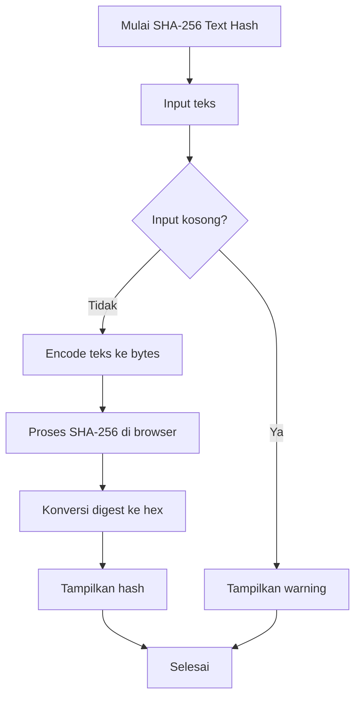

### Contoh Pengujian

| Skenario | Input | Hasil yang Diharapkan |
|---|---|---|
| Hash teks valid | `kriptografi` | Hash SHA-256 muncul |
| Input kosong | kosong | Warning |
| Input berubah | `kriptografi` vs `Kriptografi` | Hash berbeda |

---

## 3. SHA-256 Verification Tool

SHA-256 Verification Tool digunakan untuk memverifikasi integritas file. Tool ini membandingkan hash file target dengan hash referensi dari file TXT.

### Fungsi

- Menghitung hash SHA-256 dari file target.
- Membaca hash referensi dari file `.txt`.
- Membandingkan keduanya.
- Menampilkan status valid atau tidak valid.

### Format File Referensi Hash

File referensi harus berupa `.txt` yang berisi hash SHA-256 hexadecimal.

Contoh isi file:

```txt
23631c4d366c6f41666fae63a904dfba9c2d8257aa9c76c7e95dca029ace6026
```

### Cara Menggunakan

1. Siapkan file target, misalnya `target-file-kriptokit.txt`.
2. Siapkan file referensi hash, misalnya `reference-hash-valid.txt`.
3. Pada bagian **SHA-256 Verification Tool**, upload atau drag file target.
4. Upload atau drag file referensi hash.
5. Klik tombol **Verify** jika tersedia.
6. Sistem menghitung hash file target.
7. Sistem membandingkan hash file target dengan hash referensi.
8. Status akan muncul:
   - **VALID** jika hash sama.
   - **INVALID** jika hash berbeda.

### Flowchart SHA-256 Verification

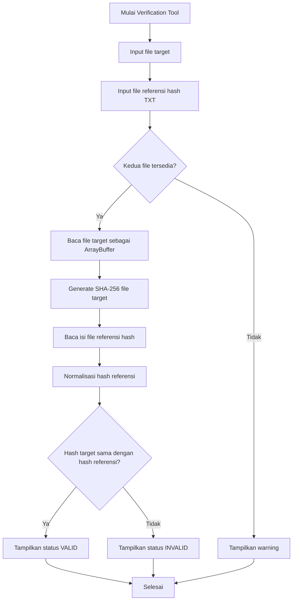

### Contoh Pengujian

| Skenario | File Target | File Referensi | Hasil yang Diharapkan |
|---|---|---|---|
| Valid | File asli | Hash file asli | VALID |
| Invalid | File asli | Hash palsu | INVALID |
| File berubah | File modifikasi | Hash file asli | INVALID |
| File kosong | Tidak ada file | Hash valid | Warning |
| Referensi kosong | File target | Tidak ada referensi | Warning |

---

## 4. Base64 Encode / Decode

Base64 digunakan untuk mengubah teks menjadi representasi encoded text, dan sebaliknya.

> Base64 bukan algoritma enkripsi. Base64 hanya encoding, sehingga tidak memberikan keamanan kriptografis.

### Fungsi

- Encode teks ke Base64.
- Decode Base64 menjadi teks asli.
- Menunjukkan perbedaan encoding dan encryption.

### Cara Encode

1. Drag operation **Base64 Encode / Decode** ke workspace.
2. Pilih mode **Encode** jika tersedia.
3. Masukkan teks biasa.
4. Klik tombol **Encode**.
5. Output Base64 akan muncul.

### Cara Decode

1. Masih di operation Base64.
2. Pilih mode **Decode** jika tersedia.
3. Masukkan teks Base64.
4. Klik tombol **Decode**.
5. Output teks asli akan muncul.

### Flowchart Base64 Encode

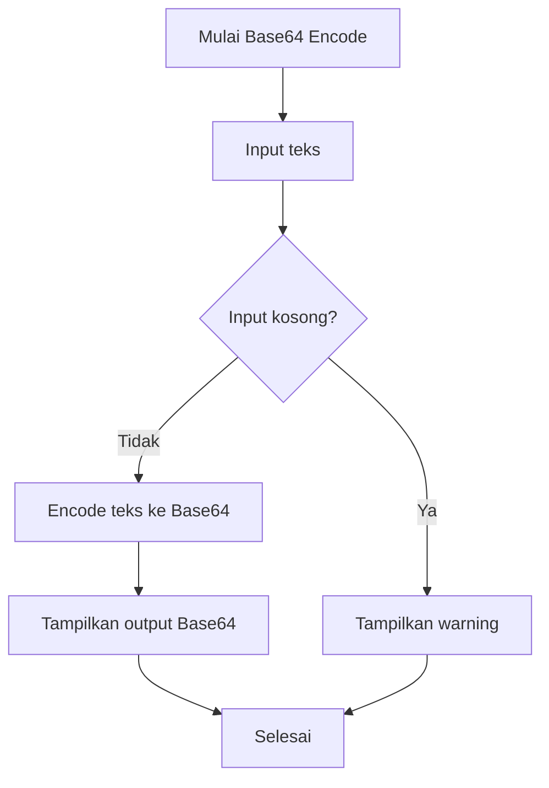

### Flowchart Base64 Decode

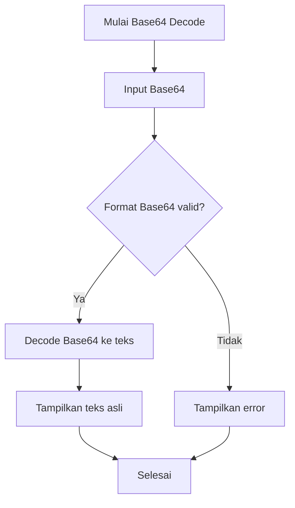

### Contoh Pengujian

| Skenario | Input | Hasil yang Diharapkan |
|---|---|---|
| Encode valid | `Halo KriptoKit` | Output Base64 muncul |
| Decode valid | `SGFsbyBLcmlwdG9LaXQ=` | `Halo KriptoKit` |
| Decode invalid | `%%%` | Error |
| Input kosong | kosong | Warning |

---

## 5. ROT13 Transform

ROT13 adalah transformasi sederhana yang menggeser huruf alfabet sebanyak 13 posisi. ROT13 bukan enkripsi modern dan tidak aman untuk pengamanan data nyata, tetapi berguna untuk demonstrasi transformasi teks.

### Fungsi

- Mengubah huruf alfabet dengan rotasi 13 karakter.
- Mengembalikan teks ROT13 dengan menjalankan ROT13 lagi.
- Menunjukkan konsep substitusi sederhana.

### Cara Menggunakan

1. Drag operation **ROT13** ke workspace.
2. Masukkan teks.
3. Klik tombol **Transform**.
4. Output ROT13 muncul.
5. Untuk mengembalikan ke teks awal, jalankan ROT13 sekali lagi pada output tersebut.

### Flowchart ROT13

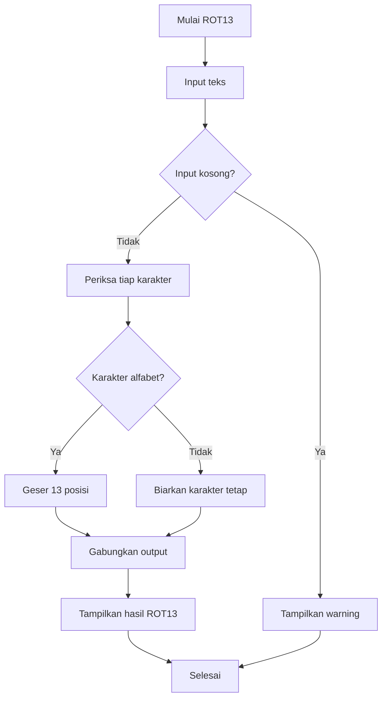

### Contoh Pengujian

| Skenario | Input | Hasil yang Diharapkan |
|---|---|---|
| Teks valid | `Halo` | `Unyb` |
| ROT13 dua kali | `Halo` -> `Unyb` -> ROT13 lagi | `Halo` |
| Angka/simbol | `Halo123!` | Angka dan simbol tetap |

---

## 6. Hex Encode / Decode

Hex operation digunakan untuk mengubah teks menjadi representasi hexadecimal dan mengubah hexadecimal kembali menjadi teks.

### Fungsi

- Encode teks ke format hex.
- Decode hex menjadi teks asli.
- Membantu memahami representasi byte/data.

### Cara Encode

1. Drag operation **Hex Encode / Decode** ke workspace.
2. Pilih mode **Encode** jika tersedia.
3. Masukkan teks.
4. Klik tombol **Encode**.
5. Output hex muncul.

### Cara Decode

1. Masih di operation Hex.
2. Pilih mode **Decode** jika tersedia.
3. Masukkan string hexadecimal.
4. Klik tombol **Decode**.
5. Output teks asli muncul.

### Flowchart Hex Encode

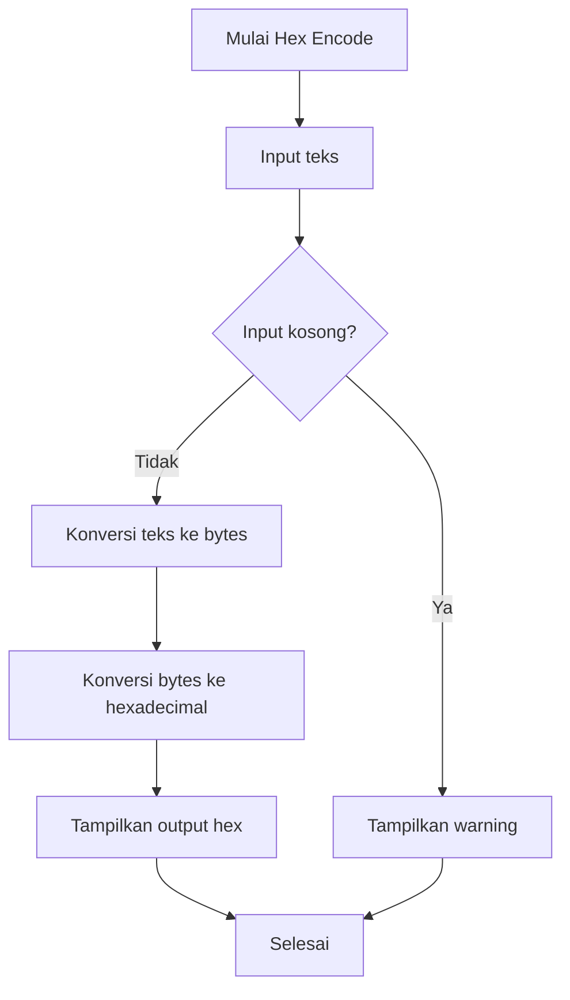

### Flowchart Hex Decode

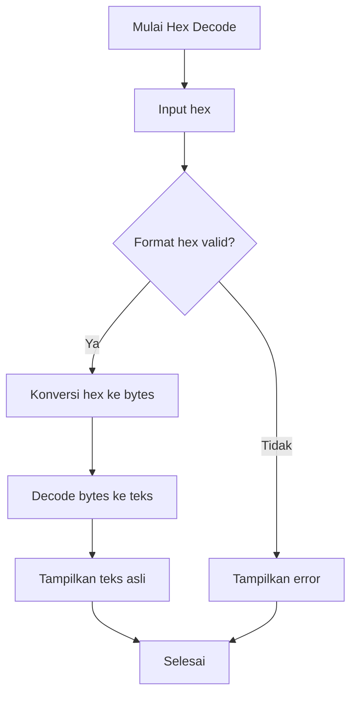

### Contoh Pengujian

| Skenario | Input | Hasil yang Diharapkan |
|---|---|---|
| Encode valid | `Halo` | `48616c6f` |
| Decode valid | `48616c6f` | `Halo` |
| Decode invalid | `xyz` | Error |
| Input kosong | kosong | Warning |

---

# Testing Checklist

| No | Operation | Skenario | Hasil yang Diharapkan | Status |
|---:|---|---|---|---|
| 1 | AES | Encrypt plaintext valid | Bundle/ciphertext muncul |  |
| 2 | AES | Decrypt dengan key benar | Plaintext kembali |  |
| 3 | AES | Decrypt dengan key salah | Error/gagal decrypt |  |
| 4 | SHA-256 Text | Hash teks valid | Hash SHA-256 muncul |  |
| 5 | SHA-256 Verification | File dan hash valid | Status VALID |  |
| 6 | SHA-256 Verification | File dan hash berbeda | Status INVALID |  |
| 7 | Base64 | Encode teks | Output Base64 muncul |  |
| 8 | Base64 | Decode Base64 valid | Teks asli muncul |  |
| 9 | ROT13 | Transform teks | Output ROT13 muncul |  |
| 10 | Hex | Encode teks | Output hex muncul |  |
| 11 | Hex | Decode hex valid | Teks asli muncul |  |
| 12 | UI | Drag operation | Operation aktif di workspace |  |

---

## Behavior

### Operation activation

User meng-drag operation card dari panel kiri ke workspace untuk mengaktifkan operasi.
Klik pada kartu operasi bukan metode utama.

### Verification tool

Tool verifikasi menerima:
- file target
- file TXT referensi berisi hash SHA-256 hex

Aplikasi menghitung hash file target secara lokal dan membandingkannya dengan hash referensi.

### Crypto helpers

Lokasinya di `lib/crypto.ts`.

Fungsi yang tersedia:
- AES multi-mode encrypt/decrypt
- Base64 helpers
- SHA-256 hashing
- ROT13
- Hex encode/decode

## User flow

Cara paling mudah untuk mencoba proyek ini:

1. `git clone <repo-url>`
2. `cd KriptoKit`
3. `npm ci`
4. `npm run dev`
5. buka `http://localhost:3000`
6. drag operation ke workspace untuk mengaktifkan mode

Kalau ingin production mode:

1. `npm ci`
2. `npm run build`
3. `npm run start`

## Notes

- Aplikasi ini sengaja dibuat client-side only.
- Tidak ada database.
- Tidak ada file upload ke server.
- Tidak ada backend API.
- Clipboard API dipakai untuk menyalin hasil output.
- Drag-and-drop adalah cara utama untuk mengaktifkan operation workspace.
- `wireframe.html` adalah referensi visual untuk arah desain dan branding.

## Untuk presentasi

Kalau ingin menjelaskan proyek ini ke dosen atau penguji, ringkasannya begini:

> KriptoKit adalah web app kriptografi ringan yang berjalan sepenuhnya di browser untuk demonstrasi AES multi-mode, Base64, SHA-256, ROT13, Hex conversion, dan file integrity verification tanpa backend.


## Demo Flow Presentasi

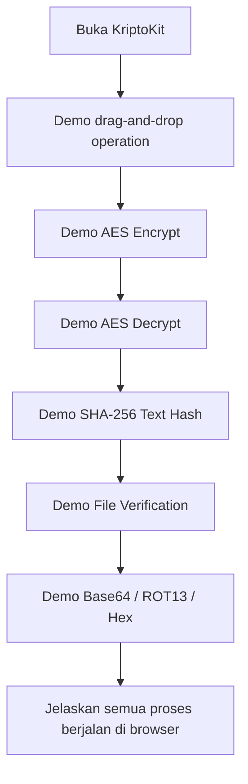


## License

Belum ditentukan. Jika dibutuhkan, tambahkan lisensi sesuai kebutuhan proyek.
