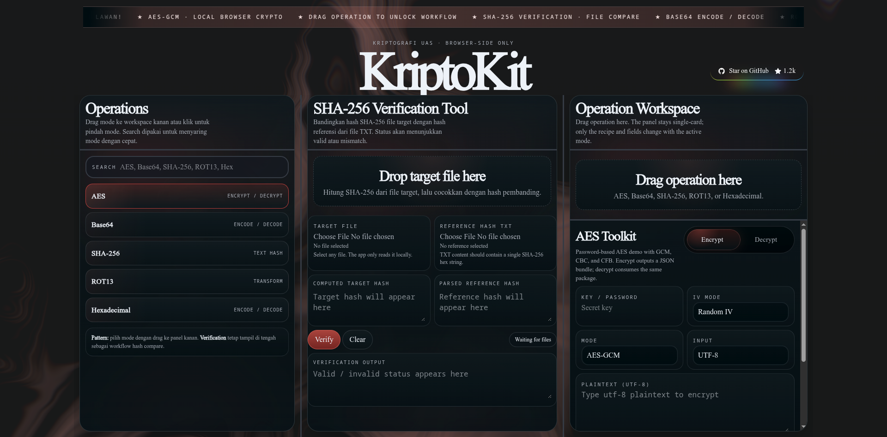

<p align="center">
  
</p>

<p align="center">
  
  
  
  
</p>

<p align="center">
  KriptoKit adalah toolkit kriptografi browser-side untuk proyek final Kriptografi. Aplikasi ini dibuat compact, editorial, dan sepenuhnya berjalan di browser tanpa backend.
</p>

## ✨ Showcase

<p align="center">
  
</p>

## 🧭 Overview

KriptoKit adalah aplikasi web kriptografi ringan yang berjalan sepenuhnya di sisi browser. Proyek ini dirancang untuk presentasi tugas akhir/UAS dengan tampilan yang kuat secara visual, alur interaksi yang sederhana, dan fokus pada demo fitur kriptografi dasar.

> ⚠️ KriptoKit berjalan sepenuhnya di browser. Tidak ada backend, database, atau upload file ke server.
>
> 💡 Gunakan drag-and-drop untuk mengaktifkan operasi utama, lalu lihat hasilnya langsung di workspace.
>
> 🔒 Seluruh pemrosesan file dan teks tetap lokal di perangkat user.

Ciri utama proyek ini:
- tampilan dark maroon dengan nuansa editorial
- header ticker yang berjalan di area hero
- background grid sebagai elemen visual
- alur drag-and-drop untuk aktivasi operasi
- semua pemrosesan tetap lokal di browser

## 🎯 Goals

- Menampilkan AES-GCM untuk enkripsi dan dekripsi teks.
- Menyediakan Base64 encode/decode.
- Menyediakan hashing SHA-256 untuk teks.
- Menyediakan ROT13 dan konversi Hex.
- Menyediakan verifikasi integritas file lewat SHA-256.
- Menjaga semuanya client-side.
- Menjaga UI tetap compact dan rapi untuk presentasi.

## 🚫 Non-Goals

- Tidak ada login.
- Tidak ada database.
- Tidak ada backend API.
- Tidak ada upload file ke server.
- Tidak ada kolaborasi multi-user.
- Tidak ada chaining kompleks seperti CyberChef.

## ⚙️ Main features

- AES-GCM encrypt / decrypt berbasis password
- Base64 encode / decode
- SHA-256 text hashing
- ROT13 transform
- Hex encode / decode
- verifikasi integritas file dengan SHA-256
- drag-and-drop untuk mengaktifkan operasi
- pencarian operasi dari sidebar
- tampilan browser-side only, tanpa upload ke server

## 🧱 Tech stack

- Next.js 14.2.35
- React 18.3.1
- TypeScript
- Browser Web Crypto API

## 🎨 Current UI direction

- Dark background dengan aksen maroon
- White grid / grid overlay
- Ambient glow merah-maroon
- Judul editorial yang besar
- Running ticker di atas area hero
- Layout 3 kolom yang compact
  - kiri: daftar operasi
  - tengah: SHA-256 verification tool
  - kanan: workspace operasi aktif
- Aktivasi utama lewat drag-and-drop

## 📁 Repository structure

```txt
KriptoKit/
├── app/
│   ├── client-shell.tsx   # UI utama dan logic interaksi
│   ├── globals.css        # styling global dan visual system
│   ├── layout.tsx         # metadata aplikasi
│   └── page.tsx           # entry page
├── assets/
│   ├── Logo.png           # logo utama KriptoKit
│   └── showcase.png       # screenshot showcase README
├── lib/
│   └── crypto.ts          # helper crypto browser-side
├── wireframe.html         # referensi visual / wireframe
├── index.html             # artefak halaman statis
├── CONTEXT.md             # konteks proyek dan arah UI
├── package.json           # scripts dan dependencies
├── package-lock.json      # locked dependencies
├── next-env.d.ts          # typing Next.js
├── tsconfig.json          # konfigurasi TypeScript
└── README.md              # dokumentasi proyek
```

## ✅ Requirements

- Node.js `>=20 <26`
- npm
- Browser modern yang mendukung Web Crypto API

Rekomendasi runtime:
- Node.js 22
- Ubuntu / Debian / distro Linux modern lainnya

## 🚀 Important scripts

- `npm run dev` - local development
- `npm run build` - production build
- `npm run start` - run production build
- `npm run typecheck` - TypeScript check

## 🛠️ Local setup

### 1. Clone repository

```bash
git clone <repo-url>
cd KriptoKit
```

### 2. Install dependencies

```bash
npm ci
```

### 3. Jalankan development server

```bash
npm run dev
```

Lalu buka:

```bash
http://localhost:3000
```

### 4. Verifikasi build

```bash
npm run typecheck
npm run build
npm run start
```

## 🐧 Ubuntu / Debian deployment

Langkah aman untuk testing di Ubuntu/Debian:

### 1. Install Node.js 22

Jika memakai `nvm`:

```bash
nvm install 22
nvm use 22
```

### 2. Clone repository

```bash
git clone <repo-url>
cd KriptoKit
```

### 3. Install dependencies

```bash
npm ci
```

### 4. Build untuk production

```bash
npm run typecheck
npm run build
```

### 5. Jalankan production app

```bash
npm run start
```

Aplikasi akan berjalan di:

```bash
http://localhost:3000
```

### 6. Akses dari device lain di jaringan lokal

Jika ingin dibuka dari perangkat lain di LAN, jalankan dev mode dengan hostname publik:

```bash
npm run dev -- --hostname 0.0.0.0
```

## 🔐 Behavior

### Operation activation

User meng-drag operation card dari panel kiri ke workspace untuk mengaktifkan operasi.
Klik pada kartu operasi bukan metode utama.

### Verification tool

Tool verifikasi menerima:
- file target
- file TXT referensi berisi hash SHA-256 hex

Aplikasi menghitung hash file target secara lokal dan membandingkannya dengan hash referensi.

### Crypto helpers

Lokasinya di `lib/crypto.ts`.

Fungsi yang tersedia:
- AES-GCM encrypt/decrypt
- Base64 helpers
- SHA-256 hashing
- ROT13
- Hex encode/decode

## 👣 User flow

Cara paling mudah untuk mencoba proyek ini:

1. `git clone <repo-url>`
2. `cd KriptoKit`
3. `npm ci`
4. `npm run dev`
5. buka `http://localhost:3000`
6. drag operation ke workspace untuk mengaktifkan mode

Kalau ingin production mode:

1. `npm ci`
2. `npm run build`
3. `npm run start`

## 📝 Notes

- Aplikasi ini sengaja dibuat client-side only.
- Tidak ada database.
- Tidak ada file upload ke server.
- Tidak ada backend API.
- Clipboard API dipakai untuk menyalin hasil output.
- Drag-and-drop adalah cara utama untuk mengaktifkan operation workspace.
- `wireframe.html` adalah referensi visual untuk arah desain dan branding.

## 📄 License

Belum ditentukan. Jika dibutuhkan, tambahkan lisensi sesuai kebutuhan proyek.
